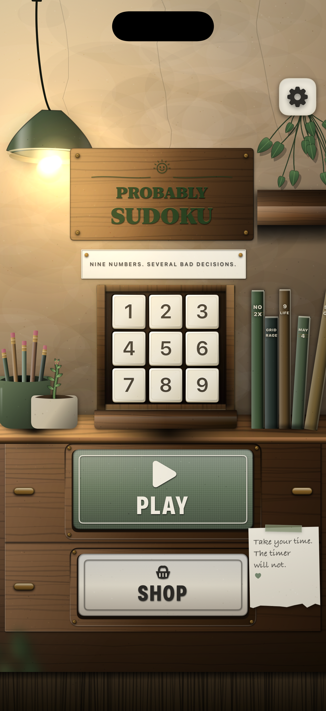
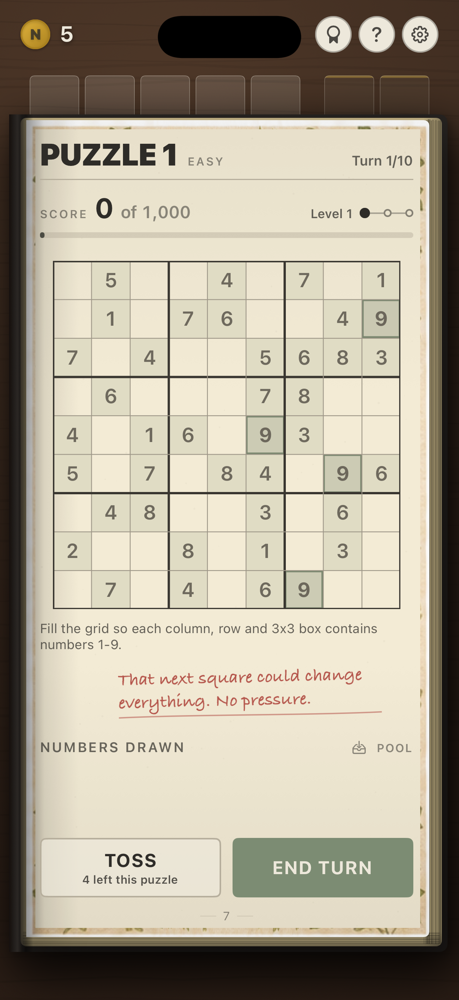
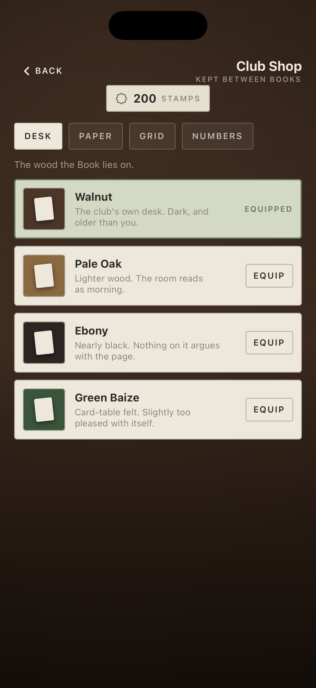

# Number Club — Design Language Baseline

This is the visual acceptance artifact for player-facing Number Club work.
Read it with [DESIGN_LANGUAGE.md](DESIGN_LANGUAGE.md): the design language is
the contract; this page shows its three anchor examples in the running game.

## The baseline in one sentence

**A live, printed puzzle Book on the desk of a small number club—not an iOS
utility wearing a game skin.**

## The three anchor captures

| Club room | Live Book | Club Shop |
| --- | --- | --- |
|  |  |  |
| **Place, not screen.** Objects rest on a desk, share a light source, and cast contact shadows. | **Work surface, not dashboard.** The grid is stable and dominant; state appears as printing, pencil, wash, and rules. | **Collection, not catalogue.** Cosmetics are physical samples with clear owned, equipped, and price states. |

## Visual acceptance checklist

| Ask this in review | Pass looks like | Fail looks like |
| --- | --- | --- |
| Does it belong in the club room? | Paper, ink, wood, brass, pencil, ribbon, stamp, book, or drawer explain the object. | Generic card, panel, toast, FAB, or abstract gradient. |
| Is the hierarchy physical and readable? | One task object dominates; quiet margins and supporting print give it room. | Every element competes with badges, colour, elevation, or motion. |
| Does interaction look like an action on an object? | Paper presses in; a tile lifts; a page turns; a stamp arrives. | Generic navigation push, glowing control, or floating system sheet. |
| Is the iconography bespoke? | Stationery glyph or clear printed verb. | New player-facing SF Symbol or a stock iOS control. |
| Can a player understand the state without colour? | Outline, wash, hatch, tick, strike, wording, and accessibility value agree. | Green/red alone carries selected, blocked, owned, or wrong state. |

## Reference map

| Reference | Source of truth | What to reuse |
| --- | --- | --- |
| Club room | `App/Views/MainMenu/MainMenuView.swift`, `ClubRoomBackdrop.swift`, `MainMenuButton.swift` | Room depth, single light source, physical controls, furniture-scale composition |
| Book volume | `App/Views/BookView.swift`, `App/Design/Theme.swift` | Page block, binding, grain, stock treatments, printed typography |
| Puzzle semantics | `App/Views/GridView.swift`, `HandStripView.swift`, `PuzzlePageView.swift` | Grid hierarchy, numeral treatment, paper actions, semantic states |
| Cosmetic materials | `App/Model/CosmeticTheme.swift`, `App/Views/ClubShop/*` | Material samples, durable ownership/equipped states, theme-safe contrast |

## Capture details

- Device: iPhone 17 Pro simulator
- App state: current debug build
- Main menu: `-mainMenu`
- Puzzle: `-skipStartScreen -seed DESIGN-LANGUAGE -selectHand 0`
- Club Shop: `-clubShop -grantClubCurrency 200 -unlockAllCosmetics`

When changing a related surface, recapture the affected state at this device
size and compare it against these anchors. A visual change is not complete if
it weakens the material world, game hierarchy, accessibility, or bespoke asset
policy established here.
